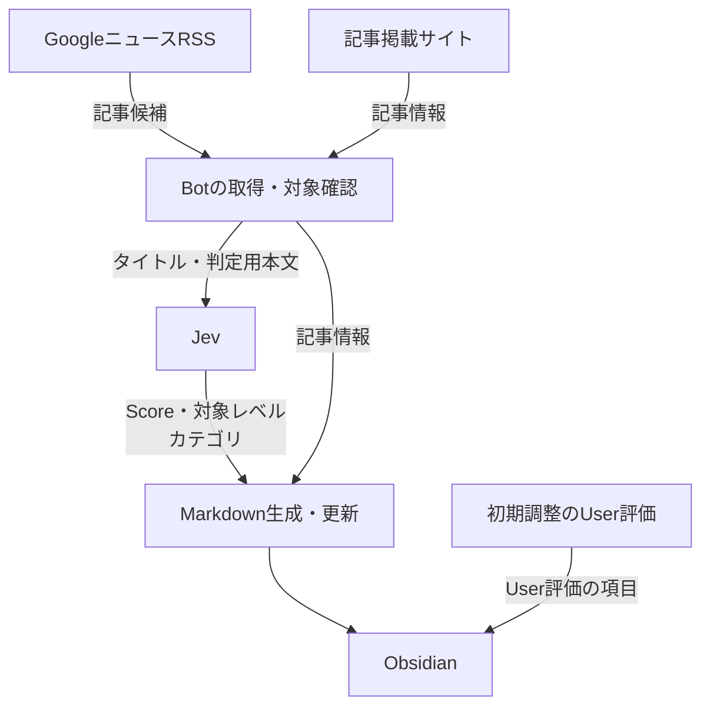

<!--
Program Name: jev-news-selector README
Language: Markdown
Function: jev-news-selectorのRepository入口。目的・概要・主な機能・利用フロー・設計文書とCURRENT.mdへの入口を示す
Created: 2026-10-06
Last Updated: 2026-10-08
Author: Takashi Oikawa
AI: Cursor
Memo: 設計段階のRepository固有README。記載した機能は設計上の仕様であり未実装。変更履歴はCHANGELOG.md、現在地点はproject-notes/CURRENT.mdを正とする
-->

# jev-news-selector

<!-- Document Info（文書情報） -->
| Item（項目） | Value（値） |
|---|---|
| Document ID（文書ID） | JNS-README-001 |
| Version（バージョン） | 0.1 |
| Status（ステータス） | Draft |
| Created Date（作成日） | 2026-10-06 |
| Last Updated（最終更新日） | 2026-10-08 |
| Owner（管理者） | Takashi Oikawa |
| Related Documents（関連文書） | [CONSTITUTION.md](./CONSTITUTION.md) / [AGENTS.md](./AGENTS.md) / [project-notes/CURRENT.md](./project-notes/CURRENT.md) / [CHANGELOG.md](./CHANGELOG.md) / [docs/design/README.md](./docs/design/README.md) |

> **Current Status（現在の状態）**
>
> 本Repositoryは設計段階である。設計は未承認の Draft であり、実装は開始していない。
>
> 本READMEに記載した機能は、設計文書で定義した仕様であり、現時点で利用できる機能ではない。
>
> 撤回事項・未確認事項・現在地点は [project-notes/CURRENT.md](./project-notes/CURRENT.md)、詳細な変更履歴は [CHANGELOG.md](./CHANGELOG.md) を参照する。

---

## Table of Contents（目次）

1. [Overview（概要）](#1-overview概要)
2. [Purpose（目的）](#2-purpose目的)
3. [Main Features（主な機能）](#3-main-features主な機能)
4. [Target Users（利用対象）](#4-target-users利用対象)
5. [Operating Environment（動作環境）](#5-operating-environment動作環境)
6. [Basic Usage Flow（基本的な利用フロー）](#6-basic-usage-flow基本的な利用フロー)
7. [Specification-Driven Development（SDDによる管理）](#7-specification-driven-developmentsddによる管理)
8. [Design Documents（設計書への入口）](#8-design-documents設計書への入口)
9. [Current Position（現在地点）](#9-current-position現在地点)

---

## 1. Overview（概要）

`jev-news-selector` は、Userが任意の時刻に手動起動するローカルBotである。

Botは、以下の処理を順に行う。

1. 最新ニュース記事を取得する。
2. 取得した記事について、Jevが対面指導への有用度・対象レベル・記事カテゴリを判定する。
3. 判定結果をMarkdownとしてObsidianへ保存する。

Botは GoogleニュースのRSSで記事を取得する。この方式は採用済みであり、検証は未完了である。入口は分野・検索語で絞り、検証用の件数上限を併用する。正本は [02_REQUIREMENTS_DEFINITION.md](./docs/design/02_REQUIREMENTS_DEFINITION.md) §5.1.6 である。Botは最終的に到達した記事URLと記事の公開日を確認し、Bot実行日または前日（日本時間）に公開された記事だけを判定・保存する。

---

## 2. Purpose（目的）

IT初心者への対面指導で使うニュース記事の収集・判定・分類・蓄積を支援する。

- 記事について、指導で共有する価値を判定する
- 記事の対象レベルとカテゴリを分類する
- 判定結果をObsidianへ蓄積し、後から参照できるようにする

背景と目的の詳細は [01_REQUEST_DEFINITION.md](./docs/design/01_REQUEST_DEFINITION.md) を正とする。

---

## 3. Main Features（主な機能）

以下は設計上の機能であり、未実装である。

- Userが任意の時刻にBotを手動起動する。定期自動起動は採用しない。記事の探索・選択・URLコピー・URL手入力は要求しない。起動のUI・コマンド形式は未確認
- GoogleニュースのRSSで記事を取得する。方式は採用済みであり、検証は未完了である。入口は分野・検索語で絞り、全検索語の合計で1回最大50件を検証用上限とする。正本は [02_REQUIREMENTS_DEFINITION.md](./docs/design/02_REQUIREMENTS_DEFINITION.md) §5.1.6
- 処理対象記事について、最終的に到達したニュース提供元の記事URL（最終記事URL）を取得する
- 記事のタイトル・公開日・判定に必要な本文を取得する
- 公開日を Asia/Tokyo（JST）の日付として扱い、Bot実行日または前日の記事だけを処理する。公開日を特定できない記事は処理しない
- Jevが指導有用度Score（評価基準は0〜4の5段階。返された値を丸めずに保存）・対象レベル・記事カテゴリ（単一値）を判定する
- 判定結果を Obsidian Vault の `Bot News/YYYY-MM-DD/`（初回処理日）へ、1記事1Markdown（YAML frontmatter付き）として保存する
- 最終記事URLを一意キーとし、登録済みの記事は対象日条件を満たす場合にJevで再判定して既存Markdownを更新する。公開日は最新の取得値へ更新し、初回処理日と保存先フォルダは変えない
- 入口の処理対象に入り、対象日判定を通過した記事は全件保存する。Jev Score を理由に除外しない
- 初期調整期間はUser評価を記録し、Jev判定と比較できるようにする。User評価はJev再判定で上書きしない

機能要件の正本は [02_REQUIREMENTS_DEFINITION.md](./docs/design/02_REQUIREMENTS_DEFINITION.md) である。

---

## 4. Target Users（利用対象）

主Userは Repository管理者本人である。不特定多数向けのサービスとして設計しない。

---

## 5. Operating Environment（動作環境）

| Item（項目） | Value（値） |
|---|---|
| Primary Environment（主環境） | MacBook Air M4 |
| OS | macOS |
| Execution（実行形態） | ローカル実行 |
| Language（言語） | Python |
| Startup（起動） | Userによる任意時刻の手動起動（起動のUI・コマンド形式は未確認。記事の探索・選択・URLコピー・URL手入力は要求しない） |

Webアプリ、クラウド常駐サービスとしては構成しない。ニュース取得は GoogleニュースのRSS方式を採用し、検証する。RSSのURL・使用ライブラリは未確認である。記事情報の抽出方式は O-05（状態は OPEN。具体値は原記録未復元）であり、[05_ARCHITECTURE_DESIGN.md](./docs/design/05_ARCHITECTURE_DESIGN.md) で管理する。

---

## 6. Basic Usage Flow（基本的な利用フロー）

データの流れの概要を次に示す。Botが受け取る情報、Jevへ渡す情報とJevの結果、Obsidianへ保存する情報を簡略化して示す。

- 対象条件を通過した記事について、Jevの判定結果と記事情報を保存・更新する流れの概要である。処理の分岐は [04_UI_AND_FLOW_DESIGN.md](./docs/design/04_UI_AND_FLOW_DESIGN.md#article-diagram) を参照する
- User評価は初期調整期間の別入力であり、Jev結果を上書きしない
- 詳細なデータの流れは [05_ARCHITECTURE_DESIGN.md](./docs/design/05_ARCHITECTURE_DESIGN.md#data-flow-diagram) を正とする
- 本図は、RSSのURL・抽出方式・使用ライブラリ・本文保存量・起動UIを定めない。公開日による対象外、再処理時の保持項目、入口の50件上限は省略しており、要件から削除したものではない

詳細図は次を開く。詳細図は04と05に置き、本書では繰り返さない。

- [入口の図](./docs/design/04_UI_AND_FLOW_DESIGN.md#entry-diagram)
- [記事ごとの図](./docs/design/04_UI_AND_FLOW_DESIGN.md#article-diagram)
- [構成の図](./docs/design/05_ARCHITECTURE_DESIGN.md#system-diagram)
- [データの流れ](./docs/design/05_ARCHITECTURE_DESIGN.md#data-flow-diagram)

初期調整期間のUser評価は、保存された記事Markdownに対してUserが別途記録する（入力方法は未決）。Jevの結果は上書きしない。

操作と分岐の詳細は [04_UI_AND_FLOW_DESIGN.md](./docs/design/04_UI_AND_FLOW_DESIGN.md) を正とする。

---

## 7. Specification-Driven Development（SDDによる管理）

本Repositoryは SDD（Specification-Driven Development）で管理する。

- `docs/design/` の設計文書を正として実装を進める
- 設計文書が `Approved` になる前に実装を開始しない
- 確定仕様と未決事項を分離して管理する
- 作業規則は [CONSTITUTION.md](./CONSTITUTION.md) と [AGENTS.md](./AGENTS.md) に従う

Repository Purpose は `DEVELOPMENT` である。

---

## 8. Design Documents（設計書への入口）

設計文書の入口は [docs/design/README.md](./docs/design/README.md) である。

| File（ファイル名） | Role（役割） |
|---|---|
| [01_REQUEST_DEFINITION.md](./docs/design/01_REQUEST_DEFINITION.md) | なぜ作るか |
| [02_REQUIREMENTS_DEFINITION.md](./docs/design/02_REQUIREMENTS_DEFINITION.md) | 何を満たすか |
| [03_DATA_AND_SECURITY_DESIGN.md](./docs/design/03_DATA_AND_SECURITY_DESIGN.md) | データ・保存・セキュリティ |
| [04_UI_AND_FLOW_DESIGN.md](./docs/design/04_UI_AND_FLOW_DESIGN.md) | User操作と処理フロー |
| [05_ARCHITECTURE_DESIGN.md](./docs/design/05_ARCHITECTURE_DESIGN.md) | 構成と責務分離 |
| [06_OPERATION_AND_HANDOFF.md](./docs/design/06_OPERATION_AND_HANDOFF.md) | 運用と実装引き継ぎ |

---

## 9. Current Position（現在地点）

作業の現在地点、次の作業、阻害要因は [project-notes/CURRENT.md](./project-notes/CURRENT.md) を正とする。
