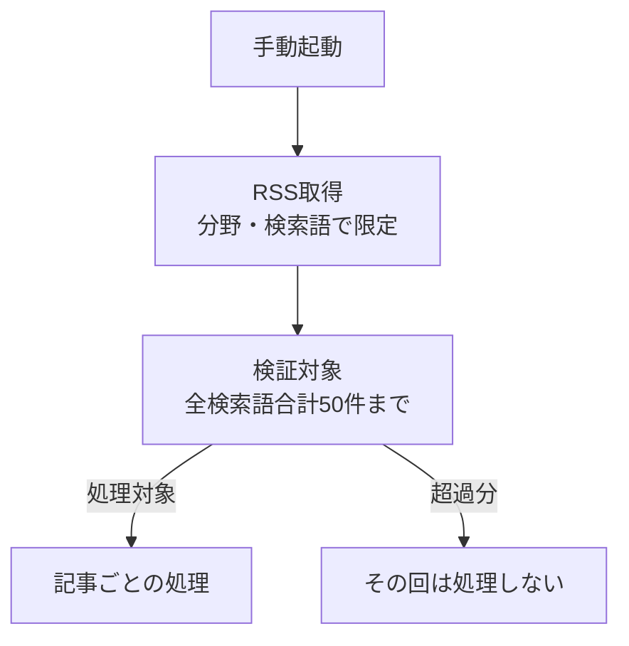
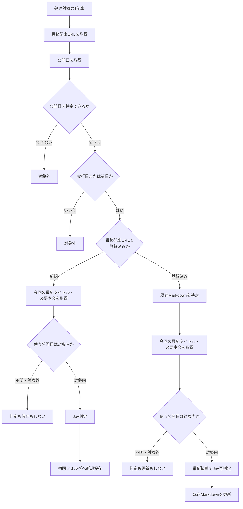

# UI and Flow Design（UI・フロー設計）

<!-- Document Info（文書情報） -->
| Item（項目） | Value（値） |
|---|---|
| Document ID（文書ID） | UI-001 |
| Version（バージョン） | 0.1 |
| Status（ステータス） | Draft |
| Created Date（作成日） | 2026-10-06 |
| Last Updated（最終更新日） | 2026-10-08 |
| Owner（管理者） | Takashi Oikawa |
| Related Documents（関連文書） | README.md / 02_REQUIREMENTS_DEFINITION.md / 03_DATA_AND_SECURITY_DESIGN.md / 05_ARCHITECTURE_DESIGN.md / 06_OPERATION_AND_HANDOFF.md / ../../project-notes/CURRENT.md |

---

## Table of Contents（目次）

1. [Purpose（目的）](#1-purpose目的)
2. [Scope（対象範囲）](#2-scope対象範囲)
3. [Out of Scope（対象外範囲）](#3-out-of-scope対象外範囲)
4. [Assumptions（前提条件）](#4-assumptions前提条件)
5. [Definition Details（定義内容）](#5-definition-details定義内容)
6. [Open Issues（未決事項）](#6-open-issues未決事項)
7. [Handoff to Detail Design（詳細設計への引き継ぎ）](#7-handoff-to-detail-design詳細設計への引き継ぎ)

---

## 1. Purpose（目的）

本文書は、`jev-news-selector` の利用者操作と処理フローを定義する正本である。起動のUI・コマンド形式は未確認であり、本文書は画面を定義しない。

読者は、利用者・設計担当・実装担当である。

---

## 2. Scope（対象範囲）

- 利用者による任意時刻のBot手動起動
- 起動後の GoogleニュースRSSによる記事取得、入口の上限、対象日判定、Jev判定、保存・更新までの処理フロー
- 対象外記事の分岐
- Jev判定と保存処理の流れ
- 登録済み記事が処理対象となった場合の流れ（再処理）
- 初期調整期間における人間評価の位置付け

---

## 3. Out of Scope（対象外範囲）

- 人間評価専用GUI
- 起動のUI・コマンド形式。未確認であり、本文書で定めない
- 入口の分野・検索語の具体一覧、RSSのURL、使用ライブラリ。[02_REQUIREMENTS_DEFINITION.md](./02_REQUIREMENTS_DEFINITION.md) §5.1.6 を正とし、本文書で補完しない
- 保存項目・ファイル名規則・更新規則の詳細。[03_DATA_AND_SECURITY_DESIGN.md](./03_DATA_AND_SECURITY_DESIGN.md) を正とする
- 公開日の決定規則の詳細。[02_REQUIREMENTS_DEFINITION.md](./02_REQUIREMENTS_DEFINITION.md) §5.1.4 を正とする

---

## 4. Assumptions（前提条件）

- 利用者は MacBook Air M4 上で、任意の時刻にBotを手動起動する。定期自動起動は採用しない
- 手動起動は記事URLの入力を伴わない
- ニュース取得は GoogleニュースのRSS方式を採用し、検証する。入口は [02_REQUIREMENTS_DEFINITION.md](./02_REQUIREMENTS_DEFINITION.md) §5.1.6 に従う

---

## 5. Definition Details（定義内容）

### 5.1 Screen List — Detail Definition（画面一覧・詳細定義）

起動のUI・コマンド形式は未確認であり、本文書では有効な画面を定義しない。

| Screen ID（画面ID） | Screen Name（画面名） | Input Items（入力項目） | Output Items（出力項目） | Main Operations（主要操作） | Notes（備考） |
|---|---|---|---|---|---|
| SCR-001 | （失効）Terminal（ターミナル） | ― | ― | ― | 2026-10-06 失効。記事URLの手入力を前提とした画面定義であり、Userの明示により撤回された。本IDを別の画面・起動方式へ転用しない |

### 5.2 Screen Transition and Business Flow（画面遷移図・業務フロー）

#### User Operation（利用者操作）

利用者は任意の時刻にBotを手動起動する。起動のUI・コマンド形式は未確認である。記事の探索・選択・URLコピー・URL手入力は要求しない。

起動以外の利用者操作は、初期調整期間の人間評価の記録（O-03）である。人間評価のデータの位置は [05_ARCHITECTURE_DESIGN.md](./05_ARCHITECTURE_DESIGN.md#data-flow-diagram) を参照する。

#### Entry Diagram

1回の手動起動における入口を示す。記事ごとの分岐は次の Article Diagram である。50件は検証用の最大件数であり、最低件数でも通常運用の上限でもない。具体的な分野・検索語の一覧は [02_REQUIREMENTS_DEFINITION.md](./02_REQUIREMENTS_DEFINITION.md) §5.1.6 に従い、図へ補完しない。

#### Article Diagram

入口に入った1記事の処理を示す。対象日判定の後に、最終記事URLで登録済みかを確認し、登録済みなら既存Markdownを特定する。新規・登録済みのどちらも、対象日条件を通過した後に今回の最新タイトルと必要本文を取得し、Jev判定に使う。対象日判定の前に、本文の全件取得を必須としない。HTTP呼出し回数は定めていない。

ここでの再取得は、前回処理時の情報に対して最新情報を取り直す意味である。同一実行内のHTTP二重呼出し、公開日の二重抽出、固定した呼出し回数を要求しない。先行して取得した今回の最新情報を使う構成を排除しない。

- 対象外では、Jev判定・新規保存・既存更新を行わない
- 登録済みの記事でも、Jev再判定には今回取得した最新のタイトルと必要本文を使う。既存Markdownの保存値を判定の入力にしない
- Jev判定と保存・更新に使う公開日は、対象日判定を通過した同じ取得値である。新規・登録済みの両方に適用する。後段の取得で公開日が変わった場合は、その最新値が対象条件を満たす必要がある。変わっていない場合は、通過した値を使う。不明または対象外のときは、Jev判定・新規保存・既存更新を行わない
- 既存更新では、`published` と本文の公開日表示をその取得値へ更新する。`processed`、初回処理日フォルダ、人間評価は保持する。その他の更新項目と保持項目は [02_REQUIREMENTS_DEFINITION.md](./02_REQUIREMENTS_DEFINITION.md) §5.1.5 を正とする
- Scoreによる保存除外の分岐はない。入口に入り対象日条件を通過した記事は全件保存する
- 登録済みの記事でも、対象日判定は毎回行う
- 公開日は、タイムゾーン付きの日時なら Asia/Tokyo へ変換した日付、日付だけなら明示された日付とする（[02_REQUIREMENTS_DEFINITION.md](./02_REQUIREMENTS_DEFINITION.md) §5.1.4）
- 同一処理日・同タイトル・別URLのファイル名は §5.4 SC-006。再処理でタイトルが変わった場合のファイル名、および取得・Jev判定・保存に失敗した場合の扱いは未確認である（[CURRENT.md](../../project-notes/CURRENT.md) Blockers）

### 5.3 Wireframes and Layout Policy（主要画面のワイヤーフレーム・レイアウト方針）

本文書では対象外。理由: 起動のUI・コマンド形式が未確認であり、本文書で画面を定義しないため。

### 5.4 Operation Flow and User Scenarios（操作フロー・ユーザーシナリオ）

| Scenario ID（シナリオID） | Operation Name（操作名） | Steps（操作手順） |
|---|---|---|
| SC-001 | 新規記事の保存 | 1. 利用者がBotを手動起動 → 2. GoogleニュースRSSで、分野・検索語と検証用上限以内の記事を取得 → 3. 最終記事URLを取得 → 4. 公開日が対象日判定を通過 → 5. 最終記事URLで未登録（新規）と判定する → 6. 今回の最新タイトルと必要本文を取得する（論理上の手順であり、追加のHTTP呼出しを要求しない。HTTP呼出し回数は定めない）→ 7. 使う公開日を確認する。対象日判定を通過した公開日を使う。後段の取得で公開日が変わった場合は、最新値が対象条件を満たす必要がある。不明または対象外なら Jev判定と新規保存を行わない → 8. 取得したタイトル・必要本文と、対象条件を満たした公開日で Jev判定する → 9. `Bot News/<処理日>/記事タイトル.md` を作成 |
| SC-002 | 公開日を特定できない記事 | 1. 手動起動後に記事を取得 → 2. 公開日を取得・特定できない → 3. 対象外として処理を終了（Jev判定・保存・更新なし） |
| SC-003 | 対象期間外の記事 | 1. 手動起動後に記事を取得 → 2. 公開日（JST）が Bot実行日・前日のいずれでもない → 3. 対象外として処理を終了（Jev判定・保存・更新なし） |
| SC-004 | 登録済み記事の再処理（対象期間内） | 1. 手動起動後に記事を取得（記事取得で得たURLは初回と異なってもよい）→ 2. 最終記事URLを取得 → 3. 公開日が対象日判定を通過 → 4. 最終記事URLで登録済みと判定し、既存Markdownを特定する → 5. 今回の最新タイトルと必要本文を取得する（既存Markdownの保存値をJev判定の入力にしない）→ 6. 使う公開日を確認する。後段の取得で公開日が変わった場合は、最新値が対象条件を満たす必要がある。不明または対象外なら Jev再判定と更新を行わない → 7. 最新のタイトル・必要本文と、対象条件を満たした公開日で Jev再判定する → 8. 既存Markdownを更新する（記事タイトル・記事冒頭・`published`・本文の公開日表示は最新の取得値へ更新。新しい処理日フォルダへ移動・複製しない。`processed` と人間評価は保持する） |
| SC-005 | 登録済み記事の再処理対象外（対象期間外） | 1. 手動起動後に登録済みの記事を取得 → 2. 公開日（JST）が対象期間外 → 3. Jev判定を行わず、既存Markdownを更新しない |
| SC-006 | 同一処理日・同タイトル・別URL | 1. 手動起動後に記事を取得 → 2. 処理日フォルダに同名ファイルがあり、最終記事URLが異なる → 3. `記事タイトル_<URL由来短縮識別子>.md` として新規作成（既存ファイルを上書きしない） |
| SC-007 | 人間評価の記録（初期調整期間） | 1. 保存された記事Markdownを確認 → 2. `human_decision` と `human_score` を記録（入力方法は O-03） |

#### Position of Human Evaluation（人間評価の位置付け）

- 人間評価は初期調整期間のみ行う
- 人間評価は保存処理とは別の利用者操作であり、Jev判定の結果を変更しない
- Jev再判定は人間評価を変更しない
- 人間評価が未記録の記事も、Jev判定と保存は成立する
- Jev判定が十分安定したと利用者が判断した時点で、新しい記事への日常的な人間評価入力を終了する。記録済みの人間評価は残す。終了後も処理フローは変わらず、全件保存を続ける
- 運用上の扱いは [06_OPERATION_AND_HANDOFF.md](./06_OPERATION_AND_HANDOFF.md) を正とする

### 5.5 Validation and Error Handling Policy（バリデーション・エラーハンドリング方針 / UI層）

| Target（対象） | Validation Rules（バリデーションルール） | Error Message / Display Policy（エラーメッセージ・表示方針） |
|---|---|---|
| 記事公開日 | 取得できない・特定できない・推測しなければ日付を決められない場合は対象外。Bot実行日・取得日・更新日・推測値で補完しない | 対象外として Jev判定・新規保存・既存Markdownの更新を行わない。利用者への表示方法・文言は、起動のUIが未確認のため本文書で定めない |
| 対象日 | 公開日（JST）が Bot実行日または前日でない場合は対象外。登録済みの記事も同じ | 同上 |

取得・Jev判定・保存に失敗した場合の扱いは未確認であり、本文書で定めない（[CURRENT.md](../../project-notes/CURRENT.md) Blockers）。

### 5.6 Accessibility and Responsive Design Policy（アクセシビリティ・レスポンシブ対応方針）

本文書では対象外。理由: 起動のUI・コマンド形式が未確認であり、本文書で画面を定義しないため。

---

## 6. Open Issues（未決事項）

| ID | Open Issue（未決事項） | Owner（担当者） | Due Date（期限） | Status（ステータス） |
|---|---|---|---|---|
| O-03 | 人間評価入力方法。初期調整期間の `human_decision` / `human_score` をどの操作で入力するか。専用GUIは要求されていない | Takashi Oikawa | 未定 | OPEN |

#### Implementation-Stage Items（実装段階で決定する事項）

| Item（項目） | Related Section（関連箇所） |
|---|---|
| 対象外記事を表示するメッセージ文言 | §5.5 |

起動のUI・コマンド形式、RSSのURL・使用ライブラリ、処理失敗時の扱いは ID未登録の未確認事項であり、[CURRENT.md](../../project-notes/CURRENT.md) の Blockers に記録する。入口の分野・検索語は [02_REQUIREMENTS_DEFINITION.md](./02_REQUIREMENTS_DEFINITION.md) §5.1.6 で管理する。

---

## 7. Handoff to Detail Design（詳細設計への引き継ぎ）

- 起動は利用者による任意時刻の手動起動である。定期自動起動を実装しない。起動のUI・コマンド形式を AI判断で決めない
- 手動起動にURL入力を伴わせない。人間による記事の探索・選択・URLコピー・URL入力を前提にしない
- 人間評価専用GUIを実装しない
- 対象日判定は登録済み判定より先に行う。対象外記事は Jev判定・新規保存・更新を行わない
- Jev判定と保存・更新に使う公開日は、対象日判定を通過した同じ取得値である。新規・登録済みの両方に適用する。後段の取得で公開日が変わった場合は、最新値が対象条件を満たす必要がある。HTTP呼出し回数は定めない
- 登録済みの記事は、最終記事URLで既存Markdownを特定し、今回の最新タイトルと必要本文を取得して、対象条件を満たした公開日で再判定し、既存Markdownを更新する。既存Markdownの保存値を判定の入力にしない。`published` と本文の公開日表示はその取得値へ更新し、処理日フォルダへ移動・複製しない。`processed` と人間評価は保持する
