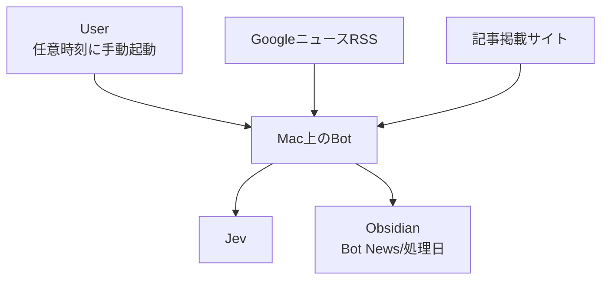
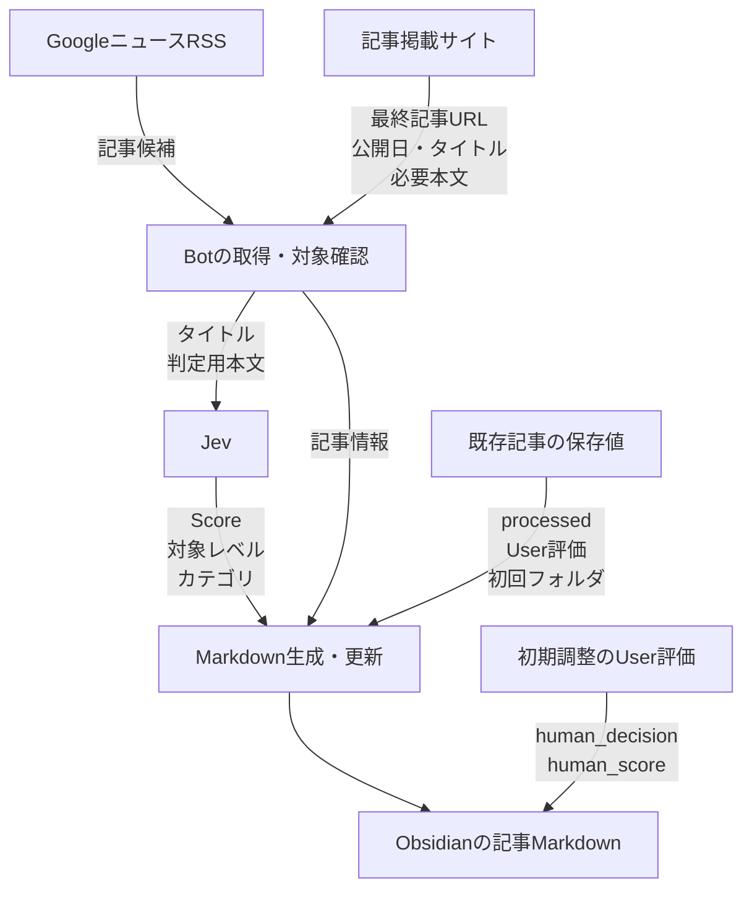

# Architecture Design（アーキテクチャ設計）

<!-- Document Info（文書情報） -->
| Item（項目） | Value（値） |
|---|---|
| Document ID（文書ID） | ARCH-001 |
| Version（バージョン） | 0.1 |
| Status（ステータス） | Draft |
| Created Date（作成日） | 2026-10-06 |
| Last Updated（最終更新日） | 2026-10-08 |
| Owner（管理者） | Takashi Oikawa |
| Related Documents（関連文書） | README.md / 02_REQUIREMENTS_DEFINITION.md / 03_DATA_AND_SECURITY_DESIGN.md / 04_UI_AND_FLOW_DESIGN.md / 06_OPERATION_AND_HANDOFF.md / ../../project-notes/CURRENT.md |

---

## Table of Contents（目次）

1. [Purpose（目的）](#1-purpose目的)
2. [Scope（対象範囲）](#2-scope対象範囲)
3. [Out of Scope（対象外範囲）](#3-out-of-scope対象外範囲)
4. [Assumptions（前提条件）](#4-assumptions前提条件)
5. [Definition Details（定義内容）](#5-definition-details定義内容)
6. [Open Issues（未決事項）](#6-open-issues未決事項)
7. [Handoff to Detail Design（詳細設計への引き継ぎ）](#7-handoff-to-detail-design詳細設計への引き継ぎ)

---

## 1. Purpose（目的）

本文書は、`jev-news-selector` のアーキテクチャの正本である。システム構成、責務分離、外部連携、実行環境を定義する。

読者は、設計担当・実装担当である。

---

## 2. Scope（対象範囲）

- ローカルPython Botの構成と責務分離
- 記事の取得元・記事掲載サイト・Jev・Obsidian Vault との連携
- 実行環境

---

## 3. Out of Scope（対象外範囲）

- サーバー、クラウド常駐、Webアプリとしての構成
- 定期自動起動
- 自動選別の仕組み。自動選別条件は未決であり、初期版に含めない
- 起動のUI・コマンド形式。未確認であり、本文書で定めない
- RSSのURL、使用ライブラリ、記事情報の抽出方式（O-05）。本文書で確定しない
- 入口の分野・検索語の具体一覧。[02_REQUIREMENTS_DEFINITION.md](./02_REQUIREMENTS_DEFINITION.md) §5.1.6 で管理し、本文書で補完しない

---

## 4. Assumptions（前提条件）

- 実行環境は MacBook Air M4 / macOS である
- Botは、Userが任意の時刻に手動起動するローカルPythonプログラムである。起動のUI・コマンド形式は未確認
- 保存先はUserのMac上の Obsidian Vault である（絶対パスは O-06。[03_DATA_AND_SECURITY_DESIGN.md](./03_DATA_AND_SECURITY_DESIGN.md)）

---

## 5. Definition Details（定義内容）

### 5.1 System Architecture Diagram（システム構成図）

処理の分岐は [04_UI_AND_FLOW_DESIGN.md](./04_UI_AND_FLOW_DESIGN.md#entry-diagram) と [Article Diagram](./04_UI_AND_FLOW_DESIGN.md#article-diagram) を正とする。本節は構成と、矢印が渡す情報を示す。RSSのURL、抽出ライブラリ、保存量、Jevの呼出方式、起動UI、HTTP呼出し回数は図で定めない。

#### System Diagram

Mac上のBotと、外部サービス、保存先の関係を示す。

#### Data Flow Diagram

矢印は渡す情報を示す。User評価は初期調整の別入力であり、Jevの結果を上書きしない。既存記事の保持項目は、再処理の更新時に使う。

- Botは MacBook Air M4 上のローカルPythonである。起動のUI・コマンド形式は未確認である
- GoogleニュースRSSは採用済みであり、検証は未完了である。URLと使用ライブラリは未確認である
- 記事掲載サイトからの抽出方式は O-05 である。状態は OPEN であり、具体値は原記録未復元である
- Jevの呼出方式は未決である。Scoreは返された値のまま後続へ渡す
- User評価の矢印は、保存済みMarkdownへの別入力である。入力UIは指定しない

### 5.2 Technology Stack and Rationale（技術スタック・採用理由）

| Type（種別） | Technology（採用技術） | Version（バージョン） | Rationale（採用理由） |
|---|---|---|---|
| Language（言語） | Python | 指定なし | Userにより確定済み |
| Framework（フレームワーク） | 未決 | 未決 | 本文書で確定しない |
| Database（DB） | 本設計に含めない | ― | 保存先は Obsidian Vault 内の Markdown である。ただし、Markdown保存であることだけを根拠にDBの採否を確定しない（[CURRENT.md](../../project-notes/CURRENT.md) Blockers） |
| Infrastructure（インフラ） | MacBook Air M4 / macOS ローカル実行 | ― | Userにより確定済み |
| Other（その他） | Obsidian Vault（YAML frontmatter付きMarkdownの保存先）、Jev（判定） | ― | Userにより確定済み |

本文書では以下を確定しない。AI判断で確定しない。

- 起動のUI・コマンド形式
- RSSのURLと使用ライブラリ（RSS方式の採用と検証は §5.3。URLとライブラリは未確認）
- 入口の分野・検索語の具体一覧（[02_REQUIREMENTS_DEFINITION.md](./02_REQUIREMENTS_DEFINITION.md) §5.1.6。原記録未復元）
- Pythonライブラリ（記事抽出用を含む。O-05。状態は OPEN。具体値は原記録未復元）
- Framework
- クラス分割
- Jev SDK / API の具体方式
- HTML抽出ライブラリ（O-05）
- URL検索方式・最終記事URLの正規化方式（O-04）
- データベースの採否

### 5.3 Module Structure and Layer Design（モジュール構成・レイヤー設計）

責務を次のとおり分離する。本節は責務の分担を定めるものであり、クラス・ファイル・パッケージの分割は定めない。

| Responsibility（責務） | Details（内容） |
|---|---|
| Startup（起動） | Userによる任意時刻の手動起動を受けて処理を開始する。URL入力を受け付ける責務を持たない。起動のUI・コマンド形式は定めない |
| Article Retrieval（記事取得・記事情報取得） | GoogleニュースのRSSで入口の処理対象を取得し、最終記事URLを取得する。記事タイトル・記事公開日・必要本文を取得する。RSS方式は採用済みであり、検証は未完了である。URLと使用ライブラリは未確認。入口の分野・検索語と検証用件数上限は [02_REQUIREMENTS_DEFINITION.md](./02_REQUIREMENTS_DEFINITION.md) §5.1.6。記事情報の抽出方式は O-05 |
| Date Judgment（公開日判定） | 公開日を JST の日付として決定し（タイムゾーン付き日時は Asia/Tokyo へ変換、日付だけなら明示された日付）、Bot実行日または前日であるかを判定する。公開日を補完しない。登録済みの記事でも毎回判定する |
| Jev Judgment（Jev判定） | Jevから指導有用度Score・対象レベル・記事カテゴリ（単一値）を得る。Scoreは返された値のまま後続へ渡し、丸めない。再処理時も同じ責務で再判定する。文章生成をさせない |
| Markdown Generation（Markdown生成） | YAML frontmatter と本文（[03_DATA_AND_SECURITY_DESIGN.md](./03_DATA_AND_SECURITY_DESIGN.md) §5.2）を組み立てる。再処理時は更新規則に従い、`published` と本文の公開日表示を最新の取得値へ更新し、`processed` とUser評価を保持する |
| Obsidian Storage（Obsidian保存） | 最終記事URLで登録済み記事を特定する（方式は O-04）。未登録なら処理日フォルダの決定・同一タイトル別URLの衝突回避・新規作成を行い、登録済みなら初回処理日フォルダの既存Markdownを更新する |

### 5.4 External Integration and API Design（外部システム連携・API設計方針）

| Integration Target / API Name（連携先 / API名） | Method（連携方式） | Purpose / Overview（用途・概要） |
|---|---|---|
| GoogleニュースRSS | RSS（採用し、検証する。URL・使用ライブラリは未確認） | 入口の処理対象の取得。分野・検索語と検証用件数上限は [02_REQUIREMENTS_DEFINITION.md](./02_REQUIREMENTS_DEFINITION.md) §5.1.6 |
| 記事掲載サイト | 未決（O-05） | 最終記事URLへの到達、記事タイトル・記事公開日・必要本文の取得 |
| Jev | 未決（実装段階で決定） | 指導有用度Score・対象レベル・記事カテゴリの判定。認証情報の扱いは [03_DATA_AND_SECURITY_DESIGN.md](./03_DATA_AND_SECURITY_DESIGN.md) §5.4 |
| Obsidian Vault | ローカルファイルとしての Markdown 作成・更新 | 判定結果の保存 |

### 5.5 Scalability and Fault Tolerance（スケーラビリティ方針・障害対策）

| Aspect（観点） | Design Details（設計内容） |
|---|---|
| Scaling Policy（スケーリング方針） | 本文書では対象外。理由: 単一Userのローカル実行であるため |
| Redundancy（冗長化） | 本文書では対象外。理由: 単一Userのローカル実行であるため |
| Failover（フェイルオーバー） | 本文書では対象外。理由: 単一Userのローカル実行であるため |
| Other Fault Tolerance（その他耐障害設計） | 本文書では定めない。取得・Jev判定・保存に失敗した場合の扱いは未確認である（[CURRENT.md](../../project-notes/CURRENT.md) Blockers）。再試行・ログ・監視・バックアップを AI判断で追加しない |

### 5.6 Infrastructure and Environment（インフラ・環境構成）

| Environment（環境） | Configuration / Resources（構成・リソース概要） |
|---|---|
| Development（開発） | MacBook Air M4 / macOS。Repository の作業場所は `~/Dev/jev-news-selector/` |
| Staging（ステージング） | なし。テスト専用環境は `~/local_test_env/jev-news-selector/` を使用する |
| Production（本番） | 本番サーバーはない。Userの MacBook Air M4 上でのローカル実行を運用環境とする |

---

## 6. Open Issues（未決事項）

| ID | Open Issue（未決事項） | Owner（担当者） | Due Date（期限） | Status（ステータス） |
|---|---|---|---|---|
| O-04 | URL重複検索方式。一意キーが最終記事URLであることは確定しており、既存Markdownをどの方法で検索するか、および最終記事URLの具体的正規化方式（追跡用Query Parameter等の扱い）が未決 | Takashi Oikawa | 未定 | OPEN |
| O-05 | 記事情報抽出方式。記事タイトル取得方式・記事公開日取得方式・記事本文取得方式、および使用するPythonライブラリ。状態は OPEN。Userから暫定採用を指摘する発言がある。具体値は原記録未復元である。再選定が必要とは断定しない | Takashi Oikawa | 未定 | OPEN |

#### Implementation-Stage Items（実装段階で決定する事項）

| Item（項目） | Related Section（関連箇所） |
|---|---|
| Jevへ渡す本文量 | §5.3 Jev Judgment |
| Jev SDK / API の具体方式 | §5.4 |

RSSのURL・使用ライブラリ、起動のUI・コマンド形式、処理失敗時の扱い、データベースの採否は、O-04・O-05 を含む既存 O-ID に該当しない ID未登録の未確認事項であり、[CURRENT.md](../../project-notes/CURRENT.md) の Blockers に記録する。入口の分野・検索語は暫定採用済みであり、具体一覧は [02_REQUIREMENTS_DEFINITION.md](./02_REQUIREMENTS_DEFINITION.md) §5.1.6 に従い補完しない。

---

## 7. Handoff to Detail Design（詳細設計への引き継ぎ）

- 責務分離は §5.3 に従う。クラス分割・ライブラリ・Framework は実装担当が独自に確定せず、設計担当・Userの承認を得る
- 起動は任意時刻の手動起動である。起動のUI・コマンド形式、RSSのURL、使用ライブラリを AI判断で採用しない。ニュース取得は GoogleニュースのRSS方式を採用し、検証する。API・Crawler を追加の確定方式として採用しない。定期自動起動を追加しない
- 記事情報の抽出方式は O-05 のままとする。具体値を補完しない。再選定が必要とは断定しない
- 一意キーは最終記事URLである。記事取得で得た別のURLで重複判定しない
- データベース、サーバー・クラウド構成、自動選別の仕組みを追加しない
