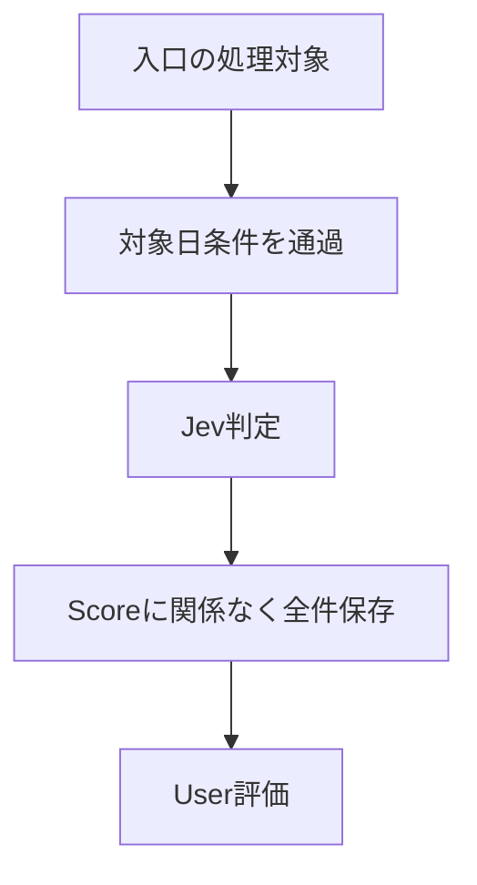
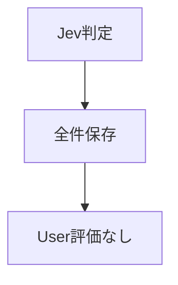
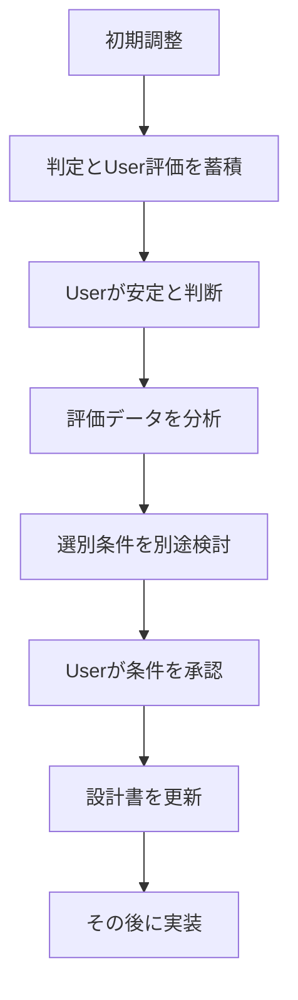

# Operation and Handoff Design（運用・詳細設計引き継ぎ）

<!-- Document Info（文書情報） -->
| Item（項目） | Value（値） |
|---|---|
| Document ID（文書ID） | OPS-001 |
| Version（バージョン） | 0.1 |
| Status（ステータス） | Draft |
| Created Date（作成日） | 2026-10-06 |
| Last Updated（最終更新日） | 2026-10-08 |
| Owner（管理者） | Takashi Oikawa |
| Related Documents（関連文書） | README.md / 01_REQUEST_DEFINITION.md / 02_REQUIREMENTS_DEFINITION.md / 03_DATA_AND_SECURITY_DESIGN.md / 05_ARCHITECTURE_DESIGN.md / ../../project-notes/CURRENT.md |

---

## Table of Contents（目次）

1. [Purpose（目的）](#1-purpose目的)
2. [Scope（対象範囲）](#2-scope対象範囲)
3. [Out of Scope（対象外範囲）](#3-out-of-scope対象外範囲)
4. [Assumptions（前提条件）](#4-assumptions前提条件)
5. [Definition Details（定義内容）](#5-definition-details定義内容)
6. [Open Issues（未決事項）](#6-open-issues未決事項)
7. [Handoff to Detail Design（詳細設計への引き継ぎ）](#7-handoff-to-detail-design詳細設計への引き継ぎ)

---

## 1. Purpose（目的）

本文書は、`jev-news-selector` の運用と実装引き継ぎの正本である。初期調整期間とその後の運用、自動選別を検討する手順、SDD運用、実装時の制約、テスト方針を定義する。

読者は、User・設計担当・実装担当である。

---

## 2. Scope（対象範囲）

- 初期調整期間の運用（全件保存・User評価・Jev判定との比較・Userによる安定判定）
- Jev安定判断後の運用（新規User評価入力の終了・全件保存の継続・既存User評価の保持）
- 自動選別条件を導入するまでの手順
- SDD運用と実装引き継ぎ
- ローカル実行と GitHub 正本の扱い
- テスト方針

---

## 3. Out of Scope（対象外範囲）

- 本番サーバー、ステージング環境、クラウドデプロイ
- 24時間監視、アラート通知
- 定期自動起動
- Jevモデルの再学習
- 自動選別条件の内容。未決であり、本文書で定めない

---

## 4. Assumptions（前提条件）

- BotはUserの MacBook Air M4 上で、Userが任意の時刻に手動起動してローカル実行する
- ニュース取得は GoogleニュースのRSS方式を採用し、検証する。入口の分野・検索語は暫定採用済みであり、[02_REQUIREMENTS_DEFINITION.md](./02_REQUIREMENTS_DEFINITION.md) §5.1.6 を正とする。具体一覧は原記録未復元のため、本文書で補完しない
- GitHub の `t-oikawa-sendai/jev-news-selector`（`main`）を正本とする
- 作業規則は [CONSTITUTION.md](../../CONSTITUTION.md) と [AGENTS.md](../../AGENTS.md) に従う

---

## 5. Definition Details（定義内容）

### 5.1 Handoff Items to Detail Design（詳細設計への引き継ぎ事項）

| ID | Handoff Item（引き継ぎ事項） | Details / Background（詳細・背景） |
|---|---|---|
| HO-001 | 未決事項の扱い | O-01〜O-06 は担当文書で管理する（所在は [README.md](./README.md) §5.2）。実装前に決定が必要な範囲はUserが判断する。入口の分野・検索語は暫定採用済みであり、[02_REQUIREMENTS_DEFINITION.md](./02_REQUIREMENTS_DEFINITION.md) §5.1.6 で管理する。具体一覧は原記録未復元のため補完しない。O-01〜O-06 に該当しない未確認事項（RSSのURL・使用ライブラリ、起動のUI・コマンド形式、再処理時のファイル名、ファイル名に使えない文字の扱い、処理失敗時の扱い、データベースの採否）は ID未登録であり、[CURRENT.md](../../project-notes/CURRENT.md) の Blockers に記録する |
| HO-002 | 実装段階で決定する事項 | 最終記事URLの具体的正規化方式（O-04）、記事抽出Pythonライブラリ（O-05。状態は OPEN。Userから暫定採用を指摘する発言があり、具体値は原記録未復元である。再選定が必要とは断定しない）、Jevへ渡す本文量・Jev SDK / API 具体方式（[05](./05_ARCHITECTURE_DESIGN.md) §6）、APIキー保存方式・URL由来短縮識別子の生成方式（[03](./03_DATA_AND_SECURITY_DESIGN.md) §6）、対象外記事のメッセージ文言（[04](./04_UI_AND_FLOW_DESIGN.md) §6）。いずれも AI判断で確定しない |
| HO-003 | 公開日の補完禁止 | 公開日を特定できない記事は対象外とする。鮮度・信頼性を確認できないためである。タイムゾーン付き日時は Asia/Tokyo へ変換し、日付だけなら明示された日付を使う |
| HO-004 | 最終記事URLによる一意管理 | 記事取得で得たURLが最終記事URLと異なる場合も、最終記事URLで重複を判定する |
| HO-005 | 再処理とUser評価の保持 | 登録済み記事でも対象日判定を行い、通過した場合のみ再取得・Jev再判定・更新する。`published` と本文の公開日表示は最新の取得値へ更新する。`processed` とUser評価を保持し、初回処理日フォルダから移動・複製しない |
| HO-006 | 同一タイトルでの上書き禁止 | 同じタイトルでも最終記事URLが異なれば別記事とし、既存ファイルを上書きしない |

### 5.2 Implementation Constraints and Notes（実装時の注意点・制約）

- 設計文書が `Approved` になる前に実装を開始しない
- 承認済み作業指示の範囲だけを実装する
- 初期版対象外（[01_REQUEST_DEFINITION.md](./01_REQUEST_DEFINITION.md) §3）の機能を追加しない
- 起動はUserによる任意時刻の手動起動とする。定期自動起動を実装しない。起動のUI・コマンド形式、RSSのURL、使用ライブラリを AI判断で決めない。ニュース取得は GoogleニュースのRSS方式を採用し、検証する。入口は [02_REQUIREMENTS_DEFINITION.md](./02_REQUIREMENTS_DEFINITION.md) §5.1.6 に従う
- Userによる記事の探索・選択・URLコピー・URL入力を前提とした処理を実装しない
- `jev_score` はJevが返した値をそのまま保存する。四捨五入・整数化・閾値処理を追加しない
- 自動選別・自動破棄を実装しない。Jevが安定したと判断された後も、§5.6 の手順を経るまで導入しない
- APIキー等の秘密情報を Git へ commit しない。設計書・README に実値を書かない
- 秘密情報の保存方式が決定する前に、AI判断で `.env` 等を実装しない
- 記事全文を保存しない
- Obsidian Vault を Git Repository 内に置かない
- 記事カテゴリ体系を AI判断で追加・削除・統合・分割・改名しない
- commit / push はUserまたは設計担当の明示指示がある場合のみ行う

### 5.3 Test Policy and Acceptance Criteria（テスト方針・受け入れ基準）

| Type（種別） | Policy / Criteria（方針・基準） |
|---|---|
| Unit Test（単体テスト） | 公開日の決定（タイムゾーン付き日時の JST 変換、日付だけの場合、特定できない場合）、対象日判定（Bot実行日・前日・2日前以前）、ファイル名衝突回避、最終記事URLによる一意判定、再処理時の更新項目と保持項目（`published` と本文の公開日表示の更新、`processed`・初回処理日フォルダ・User評価の保持）、`jev_score` の小数値が丸められずに保存されること、対象レベルが3値のいずれかであること、`jev_category` が単一値であること |
| Integration Test（結合テスト） | 記事取得から最終記事URL取得・記事情報取得・判定・保存までを通して確認する。保存先は実運用の Vault ではなく、テスト専用環境 `~/local_test_env/jev-news-selector/` を使用する。次を含める: Scoreに依存しない全件保存（Score 0 を含む）、User評価未入力での保存、対象外記事で Jev が呼び出されず既存Markdownが変更されないこと |
| System Test（システムテスト） | UserのMac上で、UserがBotを手動起動し、GoogleニュースRSSから取得された記事で確認する。検証時の入口上限は、全検索語の合計で1回最大50件である。50件を超える分がその回のJev処理へ回らないこと、入口に入り対象日条件を通過した記事がScoreを理由に除外されないことを含める。登録済み記事の再処理（対象期間内・期間外。Jev判定と更新に使う公開日は対象条件を満たした同じ取得値）、同一処理日・同一タイトル・別URL、User評価入力終了後も記録済みUser評価が保持されることを含める。分野・検索語の具体一覧は原記録未復元のため、一覧に依存する試験手順は本文書で補完しない。RSSの検証完了は、この試験方針の記載だけでは成立しない |
| Acceptance Test（受け入れテスト） | [01_REQUEST_DEFINITION.md](./01_REQUEST_DEFINITION.md) §5.5 の SC-001〜SC-007 を満たすことを、保存されたMarkdownの実ファイルで確認する |

本表は試験観点を定めるものであり、ログ・監視等の機能追加を要求しない。

### 5.4 Deployment and Release Overview（デプロイ・リリース手順概要）

サーバーへのデプロイはない。GitHub 正本の内容をUserのMac上でローカル実行する。

| Step（ステップ） | Task（作業内容） | Owner（担当） |
|---|---|---|
| 1 | 設計文書のレビューと承認 | User / 設計担当 |
| 2 | 承認済み作業指示に基づく実装とローカル検証 | 実装担当 |
| 3 | 差分レビュー | User / 設計担当 |
| 4 | 明示指示に基づく commit / push | 実装担当 |
| 5 | GitHub Actions `Validate Documents` の結果確認 | 実装担当 / User |

### 5.5 Monitoring, Alerts, and Incident Response（監視・アラート・障害対応方針）

| Aspect（観点） | Policy / Procedure（方針・手順） |
|---|---|
| Monitoring Targets and Methods（監視対象・監視方法） | 本文書では対象外。理由: 監視要件の指定がないため |
| Alert Recipients and Conditions（アラート通知先・条件） | 本文書では対象外。理由: アラート要件の指定がないため |
| Incident Confirmation Procedure（障害確認手順） | 本文書では定めない。取得・Jev判定・保存に失敗した場合の扱いは未確認である（[CURRENT.md](../../project-notes/CURRENT.md) Blockers） |
| Recovery Procedure（復旧手順） | 本文書では定めない。理由: 処理失敗時の扱いが未確認のため |
| Escalation（エスカレーション先） | 本文書では対象外。理由: 単一Userの運用であるため |

### 5.6 Operational Constraints and Maintenance（運用上の制約・定期メンテナンス）

#### Initial Adjustment Period（初期調整期間）

処理の分岐は [04_UI_AND_FLOW_DESIGN.md](./04_UI_AND_FLOW_DESIGN.md#article-diagram) を正とする。本図は初期調整の順序だけを示す。

- 入口の処理対象に入り、対象日判定を通過した記事は全件保存する。Jev Score を理由に破棄しない。Score 0 の記事も保存する。検証用の50件上限を超えた分は、その回の入口に入らない（[02_REQUIREMENTS_DEFINITION.md](./02_REQUIREMENTS_DEFINITION.md) §5.1.6）
- Userは記事ごとに `human_decision`（`adopted` / `rejected`）と `human_score`（0〜4）を記録する。入力方法は O-03
- Jev判定とUser評価の差を確認し、Jev Score の傾向、対象レベル判定、カテゴリ判定を確認する
- 確認結果を基に、確定した段階定義等を保持したまま、Jevへの instructions と criteria を調整する
- この調整で変更しないものは、[02_REQUIREMENTS_DEFINITION.md](./02_REQUIREMENTS_DEFINITION.md) §5.1.1 の0〜4の段階定義、§5.1.2 の対象レベル3値、§5.1.3 の単一Choice、カテゴリ10候補の仮定である
- 確定仕様そのものの変更には、Userの明示承認と [CONSTITUTION.md](../../CONSTITUTION.md)・[AGENTS.md](../../AGENTS.md) の既存変更手順が必要である。カテゴリ候補の追加・削除・統合・分割・改名は、Userの明示承認なしに行わない
- Jev判定が十分安定したかどうかはUser自身が判断する。固定件数・一致率・自動終了判定などの自動基準は設けない

#### After Jev Is Judged Stable（Jev安定判断後）

- 新しい記事に対する日常的なUser評価入力は、Userの判断で終了してよい
- 自動選別条件が正式に決まるまでは、対象日条件を満たした記事の全件保存を継続する
- このため、次の中間状態が存在し得る

- 記録済みの `human_decision` / `human_score` は削除しない。記録済みMarkdownはそのまま保持し、過去データを一括削除しない

#### Introduction of Automatic Selection（自動選別の導入手順）

Jevが安定したとUserが判断しても、AI判断で直ちに自動破棄・自動選別を開始してはならない。導入は次の順序に限る。

- 自動選別条件は現時点で未決である。Score閾値・confidence・カテゴリ・対象レベル等をどのように組み合わせるかは確定していない
- 自動選別条件は、蓄積されたUser評価を確認した後にUserが決定する。本設計書で AI判断により決定しない

#### Repository Operation（Repository運用）

- SDDで運用する。設計文書の承認前に実装しない
- GitHub `t-oikawa-sendai/jev-news-selector`（`main`）を正本とする
- 秘密情報を commit しない

---

## 6. Open Issues（未決事項）

本文書で管理する未決事項はない。

未決事項 O-01〜O-06 は担当文書で管理する。所在は [README.md](./README.md) §5.2 を参照する。自動選別条件は §5.6 の手順で別途検討する事項であり、初期版の未決事項 O-01〜O-06 には含めない。O-01〜O-06 に該当しない未確認事項は ID未登録であり、[CURRENT.md](../../project-notes/CURRENT.md) の Blockers に記録する。

---

## 7. Handoff to Detail Design（詳細設計への引き継ぎ）

- 設計文書の承認前に実装しない。未決事項・未確認事項と実装段階で決定する事項を、AI判断で確定しない
- 起動はUserによる任意時刻の手動起動である。定期自動起動を実装しない
- 最終記事URLによる一意管理、登録済み記事の対象日再判定と再処理、対象条件を満たした同じ取得値による `published` の更新、`processed` とUser評価の保持を守る
- 入口の分野・検索語は [02_REQUIREMENTS_DEFINITION.md](./02_REQUIREMENTS_DEFINITION.md) §5.1.6 を正とする。具体一覧を補完しない
- `jev_score` はJevが返した値をそのまま保存する
- 自動選別は §5.6 の手順を経るまで実装しない。それまで全件保存を続ける
